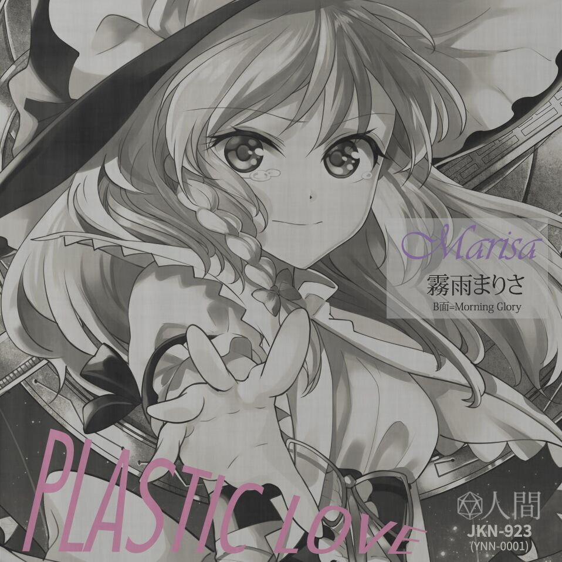

# 另一个留言板（基于 ASP.NET Core）
你为什么那么熟练啊！你到底写过多少个留言板啊！

|  API   |  描述  |  Request body  |  Response body
|  ----  |  ----  |     ----       |  ----
| `GET /api/comments`         | 获取全部留言 | 无 | 所有留言项，数组
| `GET /api/comment/{id}`     | 通过 ID 获取一条留言 | 无 | 一条留言项
| `POST /api/comment`         | 添加一条留言 | 一条留言项 | 一条留言项
| `DELETE /api/comment/{id}`  |  通过 ID 删除一条留言 | 无 | 无
